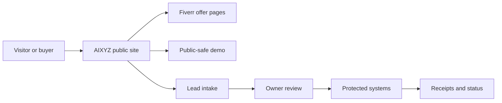
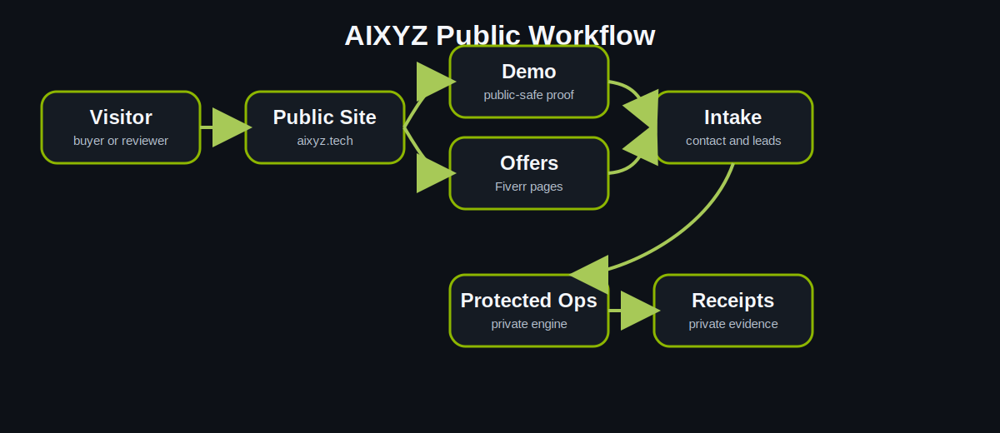
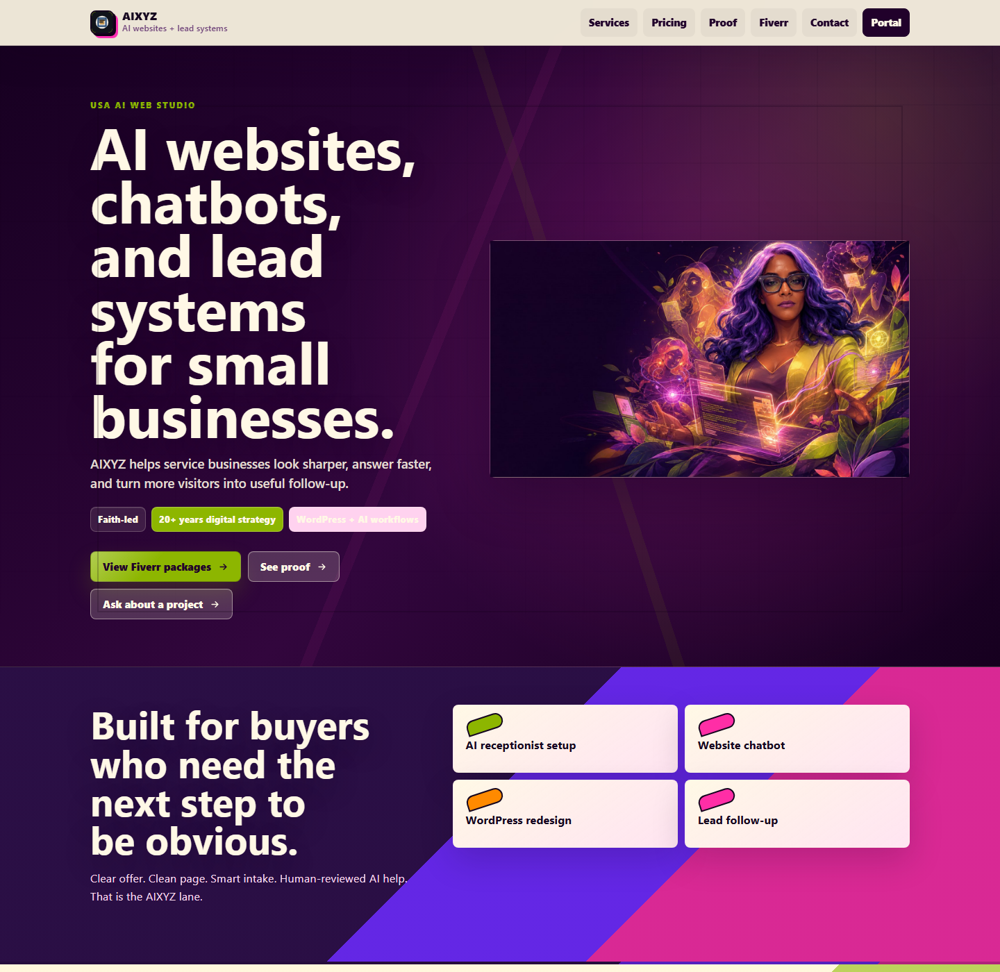
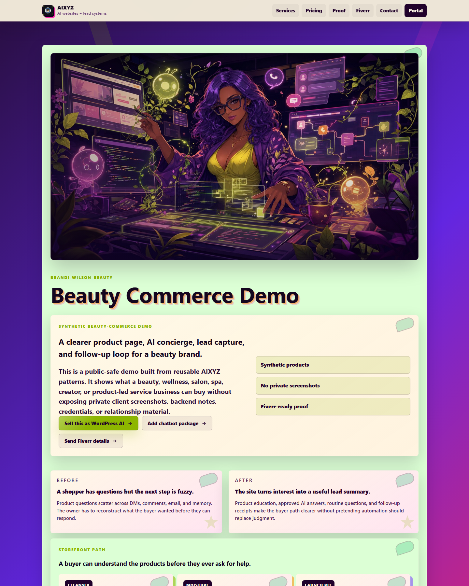
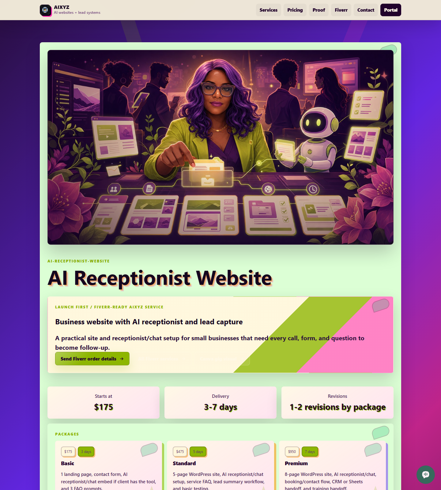

# AIXYZ

**AIXYZ** is Faith Cheltenham's AI web studio surface for public-safe demos,
Fiverr offer pages, AI receptionist workflows, and WordPress-powered business
automation examples.

This repository is a protected public project surface. It is not the full
source code, operational system, private workflow, or data room.

## Why It Matters

Small businesses need a way to see what AI-assisted web operations can actually
do before they buy. AIXYZ shows the public layer: clear offers, demos, lead
capture paths, receptionist handoffs, and owner dashboards, while keeping the
private engine, client records, credentials, and operations infrastructure
protected.

## Who It Is For

- Small business owners who need AI-ready websites.
- Service providers launching with Fiverr or similar marketplaces.
- Operators who need receptionist, intake, CRM, and follow-up workflows.
- Collaborators reviewing Faith's public AI web studio direction.

## How It Works

## What Is Public

- Project purpose and positioning.
- Public-safe screenshots.
- Workflow diagrams.
- Ownership, security, and commercial-use policies.
- WordPress page draft for FaithCheltenham.com.
- Status, roadmap, and public/private boundary notes.

## What Remains Private

- Source code and deploy scripts.
- WordPress plugin/theme internals.
- Prompts, agent instructions, and automation internals.
- Credentials, cookies, tokens, account dashboards, and payment data.
- Client records, private business notes, and backend receipts.
- Unpublished creative works and operational infrastructure.

## Current Status

The public AIXYZ site and core routes are live. The protected launch verifier
still tracks final account-side receipts for AI Receptionist and Fiverr
publishing. See [docs/STATUS.md](docs/STATUS.md).

## Visual Gallery

| Public Surface | Preview |
| --- | --- |
| AIXYZ homepage |  |
| Brandi beauty-commerce demo |  |
| Fiverr AI Receptionist offer |  |

## Learn More

- Website: [https://aixyz.tech](https://aixyz.tech)
- Faith Cheltenham: [https://faithcheltenham.com](https://faithcheltenham.com)
- Public project draft: [wordpress/page.md](wordpress/page.md)

## Ownership

Copyright (c) Faith Cheltenham. All rights reserved.

No source release. No public license. No redistribution. No commercial reuse. No
AI training permission. See [LICENSE.md](LICENSE.md), [NOTICE.md](NOTICE.md),
and [COMMERCIAL_USE_POLICY.md](docs/COMMERCIAL_USE_POLICY.md).

