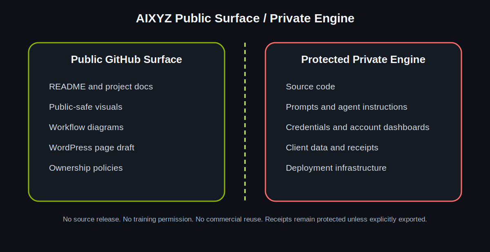

# Workflow Diagrams

## Public Workflow Overview

Source: [workflow-overview.mmd](../assets/diagrams/workflow-overview.mmd)

## Public / Private Boundary

Source: [public-private-boundary.mmd](../assets/diagrams/public-private-boundary.mmd)

These diagrams intentionally show public-safe workflow relationships only. They
do not expose private infrastructure, credentials, prompts, agent internals, or
customer data.

